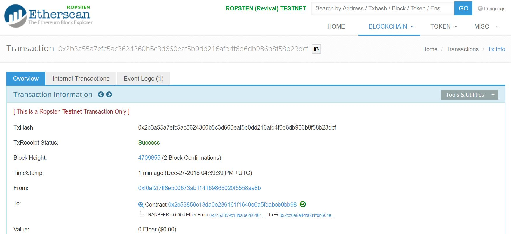

# The Seaman-Client Library


Use this library to test the **SeamansExamples** as described here: https://github.com/CaptainJavaScript/Solidity/blob/master/README.md
There are both _**a mainnet and a ropsten version**_ included in the library.

## Necessary _npm_ Packages
Please install _web3_ and _ethereumjs-tx_


## infura.io
+ Goto _infura.io_ and create a free account if you don't have one
+ Inside _infura.io_ create a new project that connects to **mainnet** _(or one that connects to **ropsten**)_
+ Whitelist _SeamansExamples_ with address _0xd73602c134B41CAC39CdEfBF1f676Ab748c3b6B4_ (mainnet) or _0xad29f36c3563417916784d4136f25b2bff77e36e_ (ropsten) in your project
+ DONE


## Seaman-Lib
+ Edit the _Seaman-Lib.js_ file
+ Add your _infura.io_ project keys
+ Add your private wallet keys with real Ether for mainnet or with test Ether for ropsten
+ DONE 


```JavaScript
module.exports =  {

    Web3ConnectionMAINNET: function() {
        const URL = "https://mainnet.infura.io/v3/<your key>";  
        const Web3 = require('web3');
        var web3 = new Web3();
        web3.setProvider(new Web3.providers.HttpProvider(URL));
        return web3;
    },

    PrivateKey: function() {
        return "<your key>";
    },
```


## Seaman-Client
+ Run the _Seaman-Client.js_ file
+ Wait for incoming events
+ Make sure the contract has enough Ether
+ DONE 


```JavaScript
const ContractConnector = require("./Seaman-Lib.js");

var IsMainnet = false;

//ContractConnector.Invoke_ActivateVoucher_AtSeaman(IsMainnet);
//ContractConnector.Invoke_CentimeterToInchExample_AtSeaman(IsMainnet, "14");
//ContractConnector.Invoke_WolframAlphaExample_AtSeaman(IsMainnet, "Spain");
//ContractConnector.Invoke_CallbackExample_AtSeaman(IsMainnet);


ContractConnector.ListenToSeaman(IsMainnet, (element) => {
    console.log("--> SEAMAN [" + element.blockNumber + "] " + element.event + ": " + element.returnValues[0]);
},
(error) => { 
    console.log(error); 
},
(log) => console.log);
```

Running this code with **node Seaman-Client.js** outputs:

```
|- listening to Seaman's Example past events...
|- starting block = 4702540 // current block = 4709890 / block increment = 300
|- now listening to Seaman's Example new events...
length: 1
--> SEAMAN [4708753] ResultLog: Ring Ring Seaman! Calling ship's bell worked! JobId = 3
length: 1
--> SEAMAN [4709424] ResultLog: Ring Ring Seaman! Calling ship's bell worked! JobId = 3
length: 5
--> SEAMAN [4709464] ResultLog: WolframAlphaExample returned the following result: <{"version":"0.2","spellingCorrection":"on","buildnumber":"6095074","query":[{"i":"France","accepted":"true","timing":"2.49","domain":"countries","resultsignificancescore":"70","summarybox":{"path":"countries/e/br/du/gh"}}]}>
--> SEAMAN [4709464] ResultLog: CentimeterToInchExample returned the following result: <[object Object]>
--> SEAMAN [4709608] ResultLog: Ring Ring Seaman! Calling ship's bell worked! JobId = 3
--> SEAMAN [4709609] ResultLog: WolframAlphaExample returned the following result: <{"version":"0.2","spellingCorrection":"on","buildnumber":"6089218","query":[{"i":"France","accepted":"true","timing":"2.43","domain":"countries","resultsignificancescore":"70","summarybox":{"path":"countries/e/br/du/gh"}}]}>
--> SEAMAN [4709609] ResultLog: CentimeterToInchExample returned the following result: <[object Object]>
length: 4
--> SEAMAN [4709829] ResultLog: CentimeterToInchExample returned the following result: <[object Object]>
--> SEAMAN [4709829] ResultLog: CentimeterToInchExample returned the following result: <[object Object]>
--> SEAMAN [4709829] ResultLog: CentimeterToInchExample returned the following result: <[object Object]>
--> SEAMAN [4709858] ResultLog: WolframAlphaExample returned the following result: <{"version":"0.2","spellingCorrection":"on","buildnumber":"6095074","query":[{"i":"Spain","accepted":"true","timing":"2.07","domain":"countries","resultsignificancescore":"70","summarybox":{"path":"countries/e/2m/y9/9y"}}]}>
```

Running the _WolframAlpha_ example outputs:
```
|- Invoke:  @ 0x2c53859c18da0e286161f1649e6a5fdabcb9bb98
|- Gas: 900000 / GasPrice: 20000000000
|- network: ropsten
|- getting transaction count...
|- lastCountOfTransactions: 24
|- nonce: 24
|- sending TX...
got txHash: 0x2b3a55a7efc5ac3624360b5c3d660eaf5b0dd216afd4f6d6db986b8f58b23dcf
```


