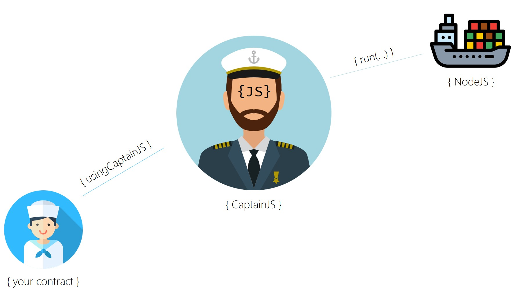

# The Seaman-Client Library


Use this library to test the **SeamansExamples** as described here: https://github.com/CaptainJavaScript/Solidity/blob/master/README.md


## Necessary _npm_ Packages
Please install _web3_ and _ethereumjs-tx_


## infura.io
+ Goto _infura.io_ and create a free account if you don't have one
+ Inside _infura.io_ create a new project that connects to **mainnet** 
+ Whitelist _SeamansExamples_ with address _0xfcd53089c3de49fa8c6cc8330cd9f49e84b01cd6_ in your project
+ DONE


## Seaman-Lib
+ Edit the _Seaman-Lib.js_ file
+ Add your _infura.io_ project key 
+ Add your private wallet key with real Ether for mainnet
+ DONE 


```JavaScript
module.exports =  {

    Web3ConnectionMAINNET: function() {
        const URL = "https://mainnet.infura.io/v3/<your key>";  
        const Web3 = require('web3');
        var web3 = new Web3();
        web3.setProvider(new Web3.providers.HttpProvider(URL));
        return web3;
    },

    PrivateKey: function() {
        return "<your key>";
    },
```


## Seaman-Client
+ Run the _Seaman-Client.js_ file
+ Wait for incoming events
+ Check https://etherscan.io/address/0xfcd53089c3de49fa8c6cc8330cd9f49e84b01cd6 for pending transactions
+ Make sure, the contract at _0xfcd53089c3de49fa8c6cc8330cd9f49e84b01cd6_ has enough Ether
+ DONE 


```JavaScript
const ContractConnector = require("./Seaman-Lib.js");

ContractConnector.Invoke_ActivateVoucher_AtSeamanMAINNET();
ContractConnector.Invoke_CallbackExample_AtSeamanMAINNET();
ContractConnector.Invoke_CentimeterToInchExample_AtSeamanMAINNET("19");
ContractConnector.Invoke_WolframAlphaExample_AtSeamanMAINNET("France");

ContractConnector.ListenToSeamanMAINNET((element) => {
    console.log("--> SEMAN [" + element.blockNumber + "] " + element.event + ": " + element.returnValues[0]);
});
```


